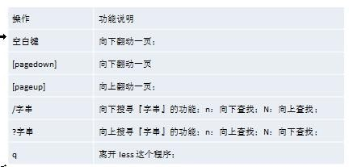

# Linux 语法
---
[toc]
---
## vi vim 篇

### 三种模式

- 正常模式
在正常模式下，我们可以使用快捷键。
以 vim 打开一个档案就直接进入一般模式了(这是默认的模式)。在这个模式中， 你可以使用『上下左右』按键来移动光标，你可以使用『删除字符』或『删除整行』来处理档案内容， 也可以使用
『复制、贴上』来处理你的文件数据。

- 插入模式/编辑模式
在模式下，程序员可以输入内容。
按下 i, I, o, O, a, A, r, R 等任何一个字母之后才会进入编辑模式,  一般来说按 i 即可
- 命令行模式
在这个模式当中， 可以提供你相关指令，完成读取、存盘、替换、离开 vim 、显示行号等的动作则是在此模式中达成的！

**转换如下图**


### 常用快捷键
1)	拷贝当前行```	yy ```,  拷贝当前行向下的 5 行```	5yy```，并粘贴（```p```）。
2)	删除当前行```	dd```	, 删除当前行向下的 5 行 ```5dd```
3)	在文件中查找某个单词  [命令模式下  **/关键字**  ， 回车  查找  ,	输入 **n** 就是查找下一个 ],```/hello```.
4)	设置文件的行号，取消文件的行号.[命令模式下	 ```set nu```  和	```set nonu```
5)	编辑 /etc/profile 文件，使用快捷键到底文档的最末行[```G```]和最首行[```gg```],注意这些都是在正常模式下执行的。
6)	在一个文件中输入  "hello" ,然后又撤销这个动作，再正常模式下输入	```u```
7)	编辑	/etc/profile 文件，正常模式下将光标移动到第 20 行	
第一步：显示行号 ```:set nu ```第二步：输入 ```20 ```这个数第三步:	输入 ```shift+g```

**键盘图如下**


---
## 开机、重启和用户登录注销

###	关机&重启命令

**基本介绍**

**shutdown**

```shutdown -h now``` : 表示立即关机
```shutdown -h 1``` : 表示 1 分钟后关机

**reboot**

等同于```shutdown -r now```立即重启

### 用户登录和注销

避免使用**root**账号登陆，在后面需要管理员权限时候使用```su -root```命令切换成管理员
注销使用```logout```命令

---
## 用户与组的管理

- Linux 系统是一个多用户多任务的操作系统，任何一个要使用系统资源的用户，都必须首先向系统管理员申请一个账号，然后以这个账号的身份进入系统。
- Linux 的用户需要至少要属于一个组。

###	添加用户
 **基本语法**

 ```useradd	[选项]	用户名```

### 给用户指定或者修改密码

 **基本语法**

 ```passwd	用户名```

### 删除用户

 **基本语法**

 ```userdel	用户名```

###	查询用户信息

 **基本语法**

 ```id	用户名```

###	切换用户

 **介绍**

 在操作 Linux 中，如果当前用户的权限不够，可以通过 su - 指令，切换到高权限用户，比如 root.

 **基本语法**

 ```su - 切换用户名```

 **细节说明**
   1) 从权限高的用户切换到权限低的用户，不需要输入密码，反之需要。
   2) 当需要返回到原来用户时，使用 exit 指令

###	用户组

  **介绍**

   类似于角色，系统可以对有共性的多个用户进行统一的管理。

  **增加组**

  ```groupadd 组名```

  **删除组**

  ```groupdel 组名```

  **增加用户时直接加上组**

  ```useradd -g 用户组 用户名```

  **修改用户的组**

  ```usermod -g 用户组 用户名```

  **/etc/passwd 文件**

  用户（user）的配置文件，记录用户的各种信息每行的含义：用户名:口令:用户标识号:组标识号:注释性描述:主目录:登录 Shell

  **/etc/shadow 文件**

  口令的配置文件每行的含义：登录名:加密口令:最后一次修改时间:最小时间间隔:最大时间间隔:警告时间:不活动时间:失效时间:标志

  **/etc/group 文件**

  组(group)的配置文件，记录 Linux 包含的组的信息每行含义：组名:口令:组标识号:组内用户列表

---
## 实用指令

### 文件目录类

#### pwd 指令
- 基本语法:
    ```pwd```	(功能描述：显示当前工作目录的绝对路径)

#### ls 指令
- 基本语法:
    ```ls [选项] [目录或文件]```
- 常用选项
    ```-a``` : 显示当前目录所有的文件和目录，包括隐藏的。
    ```-l``` : 以列表的方式显示信息

#### cd 指令
- 基本语法
    ```cd	[参数] ```(功能描述：切换到指定目录)
- 常用参数
    ```cd ~ ```或者``` cd ``` : 回到自己的家目录
    ```cd ..``` : 回到当前目录的上一级目录
- 应用实例
    案例1：使用绝对路径切换到 root 目录
        ```cd	/root```

#### mkdir 指令
- 基本语法
    ```mkdir [选项]``` : 要创建的目录
- 常用选项
    ```-p``` : 创建多级目录
- 应用实例
    案例 1:创建一个目录 /home/dog
    ```mkdir /home/dog```
    案例 2:创建多级目录 /home/animal/tiger(假设animal不存在)
    ```mkdir -p /home/animal/tiger```

#### rmdir 指令

- 基本语法
    ```rmdir``` 指令删除空目录
- 使用细节
    ```rmdir``` 删除的是空目录，如果目录下有内容时无法删除的。
    提示：如果需要删除非空目录，需要使用```rm -rf``` 要删除的目录
 
#### touch 指令
touch 指令创建空文件
- 基本语法
    ```touch``` 文件名称

#### cp 指令[重要]
cp 指令拷贝文件到指定目录
- 基本语法
    ```cp [选项] source dest```
- 常用选项
    ```-r``` ：递归复制整个文件夹
- 应用实例
    案例 1: 将  /home/aaa.txt 拷贝到	/home/bbb 目录下[拷贝单个文件]
    ```cp /home/aaa.txt /home/bbb```(目前在/root)
 
#### rm 指令
rm 指令移除【删除】文件或目录
- 基本语法
    ```rm	[选项]```	要删除的文件或目录
- 常用选项
    ```-r``` : 递归删除整个文件夹
    ```-f``` : 强制删除不提示

#### mv 指令
mv 移动文件与目录或重命名
- 基本语法
    ```mv	oldNameFile newNameFile```	(功能描述：重命名)
    ```mv /temp/movefile /targetFolder``` (功能描述：移动文件)

#### cat 指令
cat 查看文件内容，是以只读的方式打开。
- 基本语法
    ```cat	[选项]``` 要查看的文件
- 常用选项
    ```-n``` ：显示行号
- 使用细节
    cat 只能浏览文件，而不能修改文件，为了浏览方便，一般会带上管道命令``` | more```
    ```cat 文件名 | more [分页浏览]```

#### more 指令
more 指令是一个基于 VI 编辑器的文本过滤器，它以全屏幕的方式按页显示文本文件的内容。more 指令中内置了若干快捷键，详见操作说明
- 基本语法
    ```more``` 要查看的文件
- 快捷键一栏
    

#### less 指令
less 指令用来分屏查看文件内容，它的功能与 more 指令类似，但是比 more 指令更加强大，支持各种显示终端。less 指令在显示文件内容时，并不是一次将整个文件加载之后才显示，而是根据显示需要加载内容，对于显示大型文件具有较高的效率。
- 基本语法
    ```less``` 要查看的文件
- 快捷键
    

#### > 指令 和 >>  指令
- 基本语法
    ```>``` 输出重定向 : 会将原来的文件的内容覆盖
    ```>>``` 追加： 不会覆盖原来文件的内容，而是追加到文件的尾部
- 应用实例
	```cat 文件 1 > 文件 2```（功能描述：将文件 1 的内容覆盖到文件 2）
    ```ls -al >> aa.txt```（功能描述：列表的内容追加到文件 aa.txt 的末尾）

#### echo 指令
echo 输出内容到控制台。
- 基本语法
    ```echo	[选项]	[输出内容]```
- 应用实例
    案例: 使用 echo 指令输出环境变量,输出当前的环境路径。
    ```echo $PATH```

#### head 指令
head 用于显示文件的开头部分内容，默认情况下 head 指令显示文件的前 10 行内容
- 基本语法
    ```head```  文件	(功能描述：查看文件头 10 行内容)
    ```head -n 5 ```文件(功能描述：查看文件头 5 行内容，5 可以是任意行数)
 
#### tail 指令
tail 用于输出文件中尾部的内容，默认情况下 tail 指令显示文件的后 10 行内容。
- 基本语法
    ```tail 文件``` 	(功能描述：查看文件末尾 10 行内容)
    ```tail -n 5 文件```(功能描述：查看文件头 5 行内容，5 可以是任意行数)
    ```tail -f 文件```（功能描述：实时追踪该文档的所有更新，工作经常使用）

#### ln 指令
软链接也叫符号链接，类似于 windows 里的快捷方式，主要存放了链接其他文件的路径
- 基本语法
    ```ln -s [原文件或目录] [软链接名] ```（功能描述：给原文件创建一个软链接）
- 应用实例
    案例 1: 在/home 目录下创建一个软连接 linkToRoot，连接到 /root 目录
    ```ln -s /root linkToRoot```
    案例 2: 删除软连接 linkToRoot
    ```rm -rf linkToRook```
- 细节说明
    当我们使用 pwd 指令查看目录时，仍然看到的是软链接所在目录。

#### history 指令
查看已经执行过历史命令,也可以执行历史指令
- 基本语法
    ```history [数量]```	（功能描述：查看已经执行过历史命令）
- 应用实例
    案例：执行历史编号为 5 的指令
    ```!5```

### 时间日期类

#### date 指令-显示当前日期

- 基本语法
    1) ```date```	（功能描述：显示当前时间）
    2) ```date "+%Y-%m-%d %H:%M:%S"```（功能描述：显示年月日时分秒）

#### date 指令-设置日期

- 基本语法
    ```date -s 字符串时间```	

#### cal 指令

查看日历指令
- 基本语法
    ```cal [选项]	```（功能描述：不加选项，显示本月日历）

### 搜索查找类

#### find 指令
find 指令将从指定目录向下递归地遍历其各个子目录，将满足条件的文件或者目录显示在终端。
- 基本语法
    ```find	[搜索范围]	[选项]```
- 选项说明
    ```-user``` 按拥有者搜索
    ```-name``` 按名称搜索(支持通配符)
    ```-size``` 按大小搜索(=+-size)

#### grep 指令和 管道符号 |

 ```grep``` 过滤查找。
 管道符```|```，表示将前一个命令的处理结果输出传递给后面的命令处理。
- 基本语法
    ```grep [选项] 查找内容 源文件```
- 常用选项
    ```-i``` 忽略大小写
    ```-n``` 显示行号
- 应用案例
    搜索hello.txt的public字符并显示行号
    ```cat hello.txt | grep -n public```

### 打包和压缩

#### tar 指令
tar 指令 是打包指令，最后打包后的文件是.tar的文件。
- 基本语法
    ```tar	[选项]	XXX.tar```打包的内容(功能描述：打包目录)
- 选项说明
    ```-c``` 创建新文件
    ```-f``` 指定名称
    ```-z``` 同时压缩
    ```-v``` 显示详细信息
    ```-x``` 解包

#### gzip/gunzip 指令

gzip 用于压缩文件， gunzip用于解压的。**只能针对文件，不能对文件夹。文件夹压缩需要先打包**
- 基本语法
    ```gzip 文件```	（功能描述：压缩文件，只能将文件压缩为*.gz 文件）
    ```gunzip 文件.gz```	（功能描述：解压缩文件命令）

- 细节说明
    当我们使用 gzip  对文件进行压缩后，**不会**保留原来的文件。

---
## 组管理和权限管理

### Linux 组基本介绍
在 linux 中的每个用户必须属于一个组，不能独立于组外。在 linux 中每个文件有所有者、所在组、其它组的概念。
1)	所有者 : 一般是创建者(可修改)，通过```ls -l```指令可查看
2)	所在组 : 一般是所有者所在的组，通过```chgrp 组名 文件名```修改
3)	其它组 : 非所在组

### 修改文件所有者
- 基本语法：```chown 用户名 文件名```

### 权限的基本结束

    -rwxrw-r-- 1 root root 1213 Feb 2 09:39 abc
| 文件类型(1)               | 所有者权限(3)  |  所在组权限(3)          | 其他组权限(3)|
| --------                 | -----          | :----            |  :-      |
| ```-``` 普通文件          |  ```r``` 可读    |  ```r``` 可读  |    ```r``` 可读          |
| ```d``` 目录              | ```w``` 可写     | ```w``` 可写       | ```-``` 不可写         |
| ```l``` 软链接             | ```x``` 可执行  |   ```-``` 不可执行  | ```-``` 不可执行       |
| ```c``` 字符设备(鼠标/键盘) |        
| ```b``` 块文件，硬盘       |            

| 1 | root | root | 1213 | date | name |
| - |  -   |  -   |   -  |  -   |  -   |
|文件：硬链接数;目录：子目录数|所有者名|所在组名|文件大小，目录固定为4096|最后修改日期|文件名

### rwx详解
- **rwx** 作用到文件
    1)	```[ r ]``` 代表可读(read):  可以读取,查看
    2)	```[ w ]``` 代表可写(write): 可以修改,但是不代表可以删除该文件,删除一个文件的前提条件是对该文件所在的目录有写权限，才能删除该文件.
    3)	```[ x ]``` 代表可执行(execute):可以被执行
- **rwx** 作用到目录
    1)	```[ r ]``` 代表可读(read):  可以读取，```ls``` 查看目录内容
    2)	```[ w ]``` 代表可写(write):  可以修改,目录内创建+删除+重命名目录
    3)	```[ x ]``` 代表可执行(execute):可以进入该目录


### 修改权限-chmod

- 第一种方式：+ 、-、=  变更权限

    `u:所有者	g:所有组	o:其他组	a:所有人(u、g、o 的总和)`

    基本语法:
        1)	```chmod	u=rwx,g=rx,o=x	文件目录名```
        2)	```chmod	o+w	文件目录名```
        3)	```chmod	a-x	文件目录名```

    案例演示:
        1.	给 abc 文件 的所有者读,写,执行的权限，给所在组读,执行权限，给其它组读,执行权限。
    ```chmod u=rwx,g=rx,o=rx abc```
        2. 给 abc 文件的所有者除去执行的权限，增加所在组写的权限
    ```chmod u-x,g+w abc```

- 第二种方式：通过数字变更权限
    规则：```r=4 w=2 x=1```,```rwx=4+2+1=7 ```
    ```chmod u=rwx,g=rx,o=x 文件目录名```
    相当于  ```chmod 751 文件目录名```

### 10.11	修改文件所有者-chown
- 基本语法
    ```chown newowner file```	改变文件的所有者
    `chown newowner:newgroup file`	改变用户的所有者和所有组
    `-R`	如果是目录 则使其下所有子文件或目录递归生效
- 案例演示：
    1)	请将 /home/abc.txt 文件的所有者修改成 tom
        `chown tom /home/abc.txt`
    2)	请将 /home/kkk 目录下所有的文件和目录的所有者都修改成 tom
        `chown -R tom /home/kkk`

### 修改文件所在组-chgrp
- 基本语法
    `chgrp newgroup file`	改变文件的所有组

---
## crond 任务调度

- 基本语法
    `crontab [选项]`
    `service crond restart` 重启定时服务
- 常用选项
    `-e` 编辑定时任务
    `-l` 列出定时任务
    `-r` 删除当前用户的定势任务


- 任务的要求
    设置任务调度文件：`/etc/crontab`
    设置个人任务调度。执行 `crontab –e` 命令。接着输入任务到调度文件
    如：`*/1 * * * * ls –l	/etc/ > /tmp/to.txt`
    意思说每小时的每分钟执行 `ls –l /etc/ > /tmp/to.txt` 命令
	步骤如下:
    1)	`crontab -e`
    2)	`*/ 1 * * * * ls -l /etc >> /tmp/to.txt`
    3)	当保存退出后就程序。
    4)	在每一分钟都会自动的调用 `ls -l /etc >> /tmp/to.txt`

### 参数说明

| **`*`**  | **`*`** |**`*`** |**`*`**|**`*`**    |
| --       | --      | --     | --     | --           |
|分钟:0~59 |小时：0~23|天：1~31|月：1~12|星期：0~7[^crontab参数星期]|


### 特殊符号
| `*`  | `,` |`-` |`*/n` |
| --       | --      | --     |  --           |
|代表任意   |代表不连续|代表连续|代表每隔多少|


### 应用案例
|时间           | 含义                   |
| --------      | :----:  |
| `45 22 * * *` |   每天22.45执行    |
| `0 17 * * 1`  |    每周一17点执行   |
| `0 5 1,5 * *` |   每月1号，5号的5点执行 |
| `40 4 * * 1-5` |  每周一至周五4点40执行 |
| `*/10 4 * * *` |  每天4点开始每隔10分钟执行  |
| `0 4 1,5 * 1` |   1号，5号，每周一的4点执行[^crontab案例说明] |

---
## Linux 磁盘分区、挂载
- 原理介绍
    1)	Linux 来说无论有几个分区，分给哪一目录使用，它归根结底就只有一个根目录，一个独立且唯一的文件结构 , Linux 中每个分区都是用来组成整个文件系统的一部分。
    2)	Linux 采用了一种叫“载入”的处理方法，它的整个文件系统中包含了一整套的文件和目录， 且将一个分区和一个目录联系起来。这时要载入的一个分区将使它的存储空间在一个目录下获得。

###	如何增加一块硬盘
1) 添加硬盘。`lsblk -f`得出新增的磁盘`sdb`
2) 对磁盘分区	`fdisk /dev/sdb` 
3) 格式化	`mkfs -t ext4 /dev/sdb1`
4) 挂载	先创建一个`/home/newdisk`文件夹, 挂载`mount	/dev/sdb1 /home/newdisk`
5) 设置可以自动挂载(永久挂载，当你重启系统，仍然可以挂载到 `/home/newdisk`) 。
    `vim	/etc/fstab`
    `/dev/sdb1	/home/newdisk	ext4	defaults	0 0`

### 磁盘情况查询

#### 查询系统整体磁盘使用情况
- 基本语法
    `df -h`

#### 查询指定目录的磁盘占用情况
- 基本语法
    `du -h	/目录`
- 查询指定目录的磁盘占用情况，默认为当前目录
    `-s` 指定目录占用大小汇总
    `-h` 带计量单位
    `-a` 含文件
    `--max-depth=1`	子目录深度
    `-c` 列出明细的同时，增加汇总值

#### 磁盘情况实用指令
1)	统计/home 文件夹下文件的个数
    `ls -l | grep '^-' | wc -l`
2)	统计/home 文件夹下目录的个数
    `ls -l /home | grep '^d' | wc -l`
3)	统计/home 文件夹下文件的个数，包括子文件夹里的
    `ls -lR | grep '^-' | wc -l`
4)	统计文件夹下目录的个数，包括子文件夹里的
    `ls -lR /home | grep '^d' | wc -l`
5)	以树状显示目录结构
    `tree`

---

## 进程管理

### 显示系统执行的进程
- 基本语法
    查看进程使用的指令是`ps` ,一般来说使用的参数是 `ps -aux`

- 参数说明
    `-a` : 当前终端所有进程
    `-e` : 显示所有进程
    `-u` : 按用户显示进程
    `-x` : 显示后台运行参数
    `-f` : 全格式
### ps 指令详解
1) 指令：`ps –aux|grep xxx` ，比如看看有没有 sshd 服务

    •	VSZ：进程占用的虚拟内存大小（单位：KB）
    •	RSS：进程占用的物理内存大小（单位：KB）
    •	TT：终端名称,缩写 .
    •	STAT：进程状态，其中 S-睡眠，s-表示该进程是会话的先导进程，N-表示进程拥有比普通优先级更低的优先级，R-正在运行，D-短期等待，Z-僵死进程，T-被跟踪或者被停止等等
    •	STARTED：进程的启动时间
    •	TIME：CPU 时间，即进程使用 CPU 的总时间
    •	COMMAND：启动进程所用的命令和参数，如果过长会被截断显示
 

2) 查看 sshd 进程的父进程号是多少
    `ps -ef | grep sshd`
 
### 终止进程 kill 和 killall
- 基本语法：
    `kill	[选项] 进程号`（功能描述：通过进程号杀死进程）
    `killall 进程名称`（功能描述：通过进程名称杀死进程，也支持通配符，这在系统因负载过大而变得很慢时很有用）

- 常用选项：
    `-9` :表示强迫进程立即停止

- 应用案例
    1. 踢掉某个非法登录用户
        先用`ps -aux | grep sshd`查询出用户`pid`，再用`kill`
    2. 终止多个 vi  编辑器
        `killall vi`

### 查看进程树 pstree
- 基本语法：
    `pstree [选项]` ,可以更加直观的来看进程信息
- 常用选项：
    `-p` :显示进程的 PID
    `-u` :显示进程的所属用户

### 服务(Service)管理
服务(service) 本质就是进程，但是是运行在后台的，通常都会监听某个端口，等待其它程序的请求，比如(mysql , sshd 防火墙等)，因此我们又称为守护进程。
在 CentOS7.0 后 不再使用 service ,而是 systemctl

- 基本语法
    `service	服务名 [start | stop | restart | reload | status]`
- 查看系统的服务
    `ls -l /etc/init.d/服务名称`

### chkconfig 指令
通过 chkconfig 命令可以给每个服务的各个运行级别设置自启动/关闭
- 基本语法
    `chkconfig --list` : 查看服务情况
    `chkconfig	服务名	--list` : 查看某个服务
    `chkconfig --level 5 服务名 on/off` : 设置是否自启动

### 动态监控进程
top 与 ps 命令很相似。它们都用来显示正在执行的进程。top 与 ps 最大的不同之处，在于 top 在执行一段时间可以更新正在运行的的进程。
 
- 基本语法：
    `top [选项]`

- 选项说明
    `-d秒数` : 以设定秒数更新
    `-i` : 不显示空闲或僵死进程
    `-p进程号` : 指定监听的进程

- 交互操作说明
    `P` : 按CPU使用率降序
    `N` : 按PID序号降序
    `M` : 按内存降序
    `u` : 监听某用户
    `k` : 杀死某进程
    `q` : 退出

### 查看系统网络情况 netstat
用来查看监听情况以及远程登录情况
- 基本语法
    `netstat [选项]`
    `netstat -anp`
- 选项说明
    `-an`	按一定顺序排列输出
    `-p`	显示哪个进程在调用

---

## RPM和YUM

### rpm 包的简单查询指令
    查询已安装的 rpm 列表	`rpm –qa | grep xx`

### rpm 包名基本格式

一个 rpm 包名：`firefox-45.0.1-1.el6.centos.x86_64.rpm `
名称:`firefox`
版本号：`45.0.1-1`
适用操作系统: `el6.centos.x86_64`
表示 `centos6.x` 的 64 位系统
如果是 `i686`、`i386` 表示 32 位系统，`noarch` 表示通用。

### rpm 包的其它查询指令
`rpm -qa :`查询所安装的所有 rpm 软件包
`rpm -qa | more [分页显示]`

`rpm -q 软件包名` :查询软件包是否安装
`rpm -q firefox`

`rpm -qi  软件包名` ：查询软件包信息
 
`rpm -ql  软件包名 `:查询软件安装的位置

`rpm -qf 文件全路径名` 查询文件所属的软件包
`rpm -qf /etc/passwd `

###	卸载 rpm 包：

- 基本语法
    `rpm -e RPM 包的名称`

- 细节问题
1)	如果其它软件包依赖于您要卸载的软件包，卸载时则会产生错误信息。如：	`$ rpm -e	foo`
提示`removing these packages would break dependencies:foo is needed by bar-1.0-1`
2)	如果我们就是要删除 foo 这个 rpm 包，可以增加参数 `--nodeps` ,就可以强制删除，但是一般不推荐这样做，因为依赖于该软件包的程序可能无法运行
如：`$ rpm -e --nodeps `


### yum
Yum 是一个 Shell 前端软件包管理器。基于 RPM 包管理，能够从指定的服务器自动下载 RPM 包并且安装，可以自动处理依赖性关系，并且一次安装所有依赖的软件包。使用 yum 的前提是可以联网。


- yum 的基本指令
    `yum search xx` ：搜索软件包
    `yum install xx`


---
## shell
### shell 快速入门

- 脚本格式要求
    1)	脚本以#!/bin/bash 开头
 
    2)	脚本需要有可执行权限

- 脚本的常用执行方式
    1. 给予执行权限`chmod a+x test.sh`
    2. 执行`./test.sh`
    3. 方式 2(sh+脚本)，不推荐`sh ./test.sh`

### shell 的变量
1) 定义变量：`变量=值`
2) 撤销变量：`unset 变量`
3) 声明静态变量：`readonly 变量`，注意：不能 `unset`
4) 变量名称一般习惯为大写

### 将命令的返回值赋给变量
1）	```A=`ls -la` ``` 反引号，运行里面的命令，并把结果返回给变量 A
2）	`A=$(ls -la)` 等价于反引号

### 设置环境变量(/etc/profile)
- 基本语法
    1. `export 变量名`
    2. `source 配置文件` 使其起效
    3. `echo $变量名` 

### 位置参数变量
- 介绍
    当我们执行一个 shell 脚本时，如果希望获取到命令行的参数信息，就可以使用到位置参数变量，比如 ： `./myshell.sh 100 200` ,  这个就是一个执行 shell 的命令行，可以在 myshell 脚本中获取到参数信息
- 基本语法
    `$n` （功能描述：`n` 为数字，`$0` 代表命令本身，`$1`-`$9` 代表第一到第九个参数，十以上的参数，十以上的参数需要用大括号包含，如`${10}`）
    `$*` （功能描述：这个变量代表命令行中所有的参数，`$*`把所有的参数看成一个整体）
    `$@`（功能描述：这个变量也代表命令行中所有的参数，不过`$@`把每个参数区分对待）
    `$#`（功能描述：这个变量代表命令行中所有参数的个数）


### 预定义变量
- 基本介绍
    就是 shell 设计者事先已经定义好的变量，可以直接在 shell 脚本中使用
- 基本语法
    `$$` （功能描述：当前进程的进程号（PID））
    `$!` （功能描述：后台运行的最后一个进程的进程号（PID））
    `$?` （功能描述：最后一次执行的命令的返回状态。如果这个变量的值为 0，证明上一个命令正确执行；如果这个变量的值为非 0（具体是哪个数，由命令自己来决定），则证明上一个命令执行不正确

### 运算符
- 基本介绍
    学习如何在 shell 中进行各种运算操作。
- 基本语法
    1)  `$((运算式))`或`$[运算式]`
    2)	`expr m + n`
        注意 expr 运算符间要有空格
    4)	`expr	\*, /, %`	乘，除，取余

###	条件判断

- 基本语法
    `[ condition ]`（注意 condition 前后要有空格）
    非空返回 true，可使用`$?`验证（0 为 true，>1 为false) 

- 常用判断条件

    1) 两个整数的比较
    `=` 字符串比较
    `-lt` 小 于
    `-le` 小于等于
    `-eq` 等 于
    `-gt` 大 于
    `-ge` 大于等于
    `-ne` 不等于
    2) 按照文件权限进行判断
    `-r` 有读的权限  [ -r  文件  ]
    `-w` 有写的权限
    `-x` 有执行的权限
    3)按照文件类型进行判断
    `-f` 文件存在并且是一个常规的文件
    `-e` 文件存在
    `-d` 文件存在并是一个目录

### 流程控制

#### if 判断
- 基本语法
    ```
    if [ 条件判断式 ];then
        程序
    fi
    ```
    或者
    ```
    if [ 条件判断式 ]
    then
        程序
    elif [ 条件判断 ]
    then
        程序
    fi
    ```
    注意事项：（1）[ 条件判断式 ]，中括号和条件判断式之间必须有空格 (2) 推荐使用第二种方式

- 应用实例
    1. `if [ -e ./test.txt ]` 如果存在`test.txt`文件
    2. `if [ $1 -gt 5 ]` 如果第一个参数大于5 
 
#### case 语句
- 基本语法
    ```
    case $变量名 in
    "值 1"）
    程序 1
    ;;
    "值 2"）
    程序 2
    ;;
    …省略其他分支…
    *）
    程序other
    ;;
    esac
    ```

#### for 循环
- 基本语法 
    ```
    for 变量 in 值 1 值 2 值 3…
    do
        程序
    done
    ```
    或者
    ```
    for (( 初始值; 循环控制条件; 变量变化 ))
    do
        程序
    done
    ```

#### while 循环
- 基本语法
    ```
    while [ 条件判断式 ]
    do
    程序
    done
    ```

### read 读取控制台输入

- 基本语法
    `read(选项)(参数)`
- 选项：
    `-p`：指定读取值时的提示符；
    `-t`：指定读取值时等待的时间（秒），如果没有在指定的时间内输入，就不再等待了
    `变量`：指定读取值的变量名
- 应用案例
    `read -t 5 -p "输入数字" NUM`

### 函数
- 函数介绍
    shell 编程和其它编程语言一样，有系统函数，也可以自定义函数。系统函数中，我们这里就介绍两个。
- 系统函数

    - basename 
        功能：返回完整路径最后 / 的部分，常用于获取文件名
        `basename [pathname] [suffix]`
 

        选项：
        `suffix` 为后缀，如果 `suffix` 被指定了，`basename` 会将 `pathname` 或 `string` 中的 `suffix` 去掉。

    - dirname
        功能：返回完整路径最后 / 的前面的部分，常用于返回路径部分
        `dirname 文件绝对路径` （功能描述：从给定的包含绝对路径的文件名中去除文件名（非目录的部分），然后返回剩下的路径（目录的部分））
        `dirname /etc/profile`

- 自定义函数
    - 基本语法
        ```
        [ function ] funname[()]
        {
        Action; 
        [return int;]
        }
        ```

        调用直接写函数名：`funname	[值]`
    - 应用案例
        ```
        function getSum(){
            return $[$1+$2]
        }

        getSum 4 5
        SUM=$?
        echo $SUM
        ```

[^crontab参数星期]: 0和7都是星期天
[^crontab案例说明]: 不推荐星期和日期混用