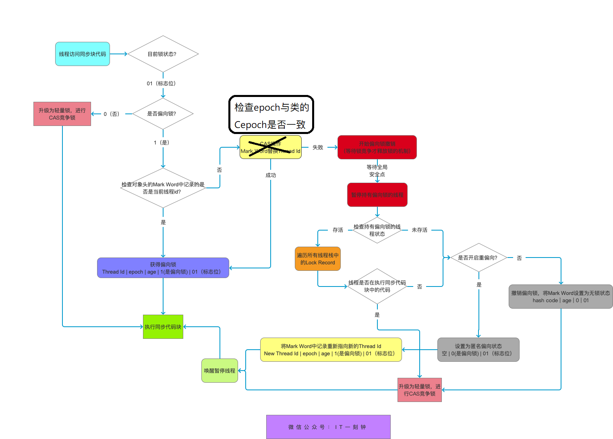

# 使用线程
- 继承 Thread 类
- 实现 Runnable 接口
- 实现 Callable 接口

实现两个接口的类智能当作一个可在线程中执行的任务, 不是真正意义上的线程, 最后还是得通过 Thread 类来调用
## 实现 Callable 接口
与 Runnable 相比, Callable 可以有返回值, 返回值通过 FutureTask 进行封装

```java
public class MyCallable implements Callable<Integer> {
    public Integer call() {
        return 123;
    }
}
public static void main(String[] args) throws ExecutionException, InterruptedException {
    MyCallable mc = new MyCallable();
    FutureTask<Integer> ft = new FutureTask<>(mc);
    Thread thread = new Thread(ft);
    thread.start();
    System.out.println(ft.get());
}
```

## 继承 Thread 类
同样也是需要实现 run 方法, 因为 Thread 类也实现了 Runnable 接口

## 实现接口 Vs 继承 Thread
实现接口更好一点
- Java 不允许多重继承, 因此继承 Thread 类无法继承其他类, 而可以实现多个接口
- 继承 Thread 类可能开销过大

# 中断
一个线程执行完毕会自动退出, 如果执行过程发生异常也会提前结束

## InterruptedException
调用一个类的 interrupt() 方法来中断线程执行, 如果线程处于 blocked, timed_waiting, waiting 的状态, 就会抛出该异常, 中断执行. 但不能中断 i/o 阻塞或 synchronized 锁阻塞

# 互斥同步 (加锁)
- synchronized (jvm 实现)
- ReentrantLock (jdk 实现)

## synchronized
在 Java 早期版本中，synchronized 属于 重量级锁，效率低下。
因为监控器锁 (monitor) 依赖底层操作系统 mutex Lock 实现, Java 的线程映射到操作系统的原生线程上, 因此挂起和唤醒都需要操作系统实现, 而操作系统的线程切换需要从用户态转为内核态, 这个转换的时间成本较高
==注意: 对象的wait(), notify() 等方法需要在同步代码块里才能调用, 否则会抛异常==

### 使用
1. 修饰实例方法 (锁住该对象)
2. 修饰静态方法 (锁住类)
==注意: 允许两个线程, 在同一时间, 一个访问类的同步方法, 一个访问实例的同步方法, 因为这两个方法锁住的对象不同==
3. 修饰代码块 (锁住括号里面的对象)
==注意: 尽量不要锁住 String, Integer 这类有缓存池的对象==

### 单例模式
一个类只有一个实例对象, 如 Spring 中的 Service, Controller
```java
class Singleton {
    private static volatile Singleton single;

    public static Singleton getSingle() {
        if (single == null) {
            synchronized (Singleton.class) {
                if (single == null) {
                    single = new Singleton();
                }
            }
        }
        return single;
    }
}
```

volatile 修饰的目的:
1. 保证可见性, 保证每个线程得到的都是当前内存中的状态
2. 保证有序性, 确保 jvm 不会指令重排, 以保证得到的 single 对象一定已经创建好了

### Java 对象头
对象头包含三部分
1. markword
存储 hashcode, gc分代年龄, 锁标志, 偏向线程
2. 类型指针
指向对象的类元数据, jvm 通过此指针确定是哪个类的实例
3. 数组特有的储存长度

对象头
 长度 | 内容 | 说明
 - | - | - 
 一个字(32 bits/ 64bits) | markword | 存储hashcode等信息
 同上 | Class metadata Addr | 存储对象类型指针
 同上 | array length | 数组长度

### synchronized 锁分类
级别低到高依次是
1. 无锁
2. 偏向锁
3. 轻量锁 (自旋)
4. 重量锁

锁只能升级, 不能降级

各状态 markword

**无锁**
25 bits | 4 bits | 1 bit (是否偏向) | 2 bits
 - | - | - | -
hashcode | gc 分代年龄 | 0 | 01

**偏向锁**
23 bits | 2 bits | 4 bits | 1 bit (是否偏向) | 2 bits
 - | - | - | - | -
线程id | epoch | gc 分代年龄 | 1 | 01

**轻量锁**
30 bits  | 2 bits
- | -
指向==线程栈中的锁记录== | 00

**重量锁**
30 bits  | 2 bits
- | -
指向==monitor== | 10

### 加锁过程




1. 判断锁对象的 markword 最后两位, 来判断锁对象此时有没有上锁
2. 接着判断偏向锁标志位是否为 1 , 如果不是, 则进行 CAS 竞争轻量锁, 即到 5
3. (偏向锁) 此时判断 markword 的 threadId 是否为本线程, 如果是, 则添加一条 lock record, 表示重入次数. 如果否, 则判断锁对象的 epoch 和该类的 cEpoch 是否相同
    1. 如果 epoch < cEpoch, 说明发生过批量重偏向, 直接CAS加偏向锁
    2. 如果 epoch = cEpoch, 竞争锁
4. 竞争锁得等到全局安全点(safe point，代表了一个状态，在该状态下所有线程都是暂停的), 此时有两个判断
    1. 持有偏向锁的对象的线程已退出同步代码块, 或者持有锁对象的线程已不存活, 则撤销偏向锁, 恢复到无锁状态(且不能偏向, 最后三位 001)
    2. 持有锁对象的线程仍存活且在同步代码块内, 则锁升级为轻量锁, 且该线程仍持有锁
5. (轻量锁) 先在线程的栈帧里赋值当前锁对象的markword, 然后 CAS 替换, 成功则获取到锁, 失败则首先自旋, 当自旋次数到达一定次数进入锁膨胀
6. (重量锁) 此时锁对象的markword将指向monitor对象, 获取不到锁的线程将进入 EntrySet 集合中, 并处于 blocked (阻塞)状态
7. (轻量锁的释放) 获得锁对象的线程进行 CAS 将自己拥有的 Markword 替换回此时锁对象的 markword, 如果成功, 则直接退出. 如果失败, 说明此时已升级为重量锁, 唤醒其他线程进行新一轮竞争

特别说明:
1. CAS记录owner时，expected == null，newValue == ownerThreadId，因此，只有第一个申请偏向锁的线程能够返回成功，后续线程都必然失败
2. 当一个对象已经计算过identity hash code，它就无法进入偏向锁状态
3. 当一个对象当前正处于偏向锁状态，并且需要计算其identity hash code的话，则它的偏向锁会被撤销，并且锁会膨胀为重量锁
4. 重量锁的实现中，ObjectMonitor类里有字段可以记录非加锁状态下的mark word，其中可以存储identity hash code的值。或者简单说就是重量锁可以存下identity hash code。
    这里讨论的hash code都只针对identity hash code。用户自定义的hashCode()方法所返回的值跟这里讨论的不是一回事。Identity hash code是未被覆写的 java.lang.Object.hashCode() 或者 java.lang.System.identityHashCode(Object) 所返回的值。
5. 重量锁还有一个 waitSet 集合, 用于线程调用锁对象的 wait() 方法时, 将线程加入此集合中(此时会释放锁), 等待其他线程调用 notify() 方法将其唤醒

### synchronized 与 ReentrantLock 的区别
1. 都是可重入锁
2. synchronized 依赖 jvm 而 ReentrantLock 依赖 API
    - synchronized 是虚拟机层面实现的，并没有直接暴露给我们。ReentrantLock 是 JDK 层面实现的（也就是 API 层面，需要 lock() 和 unlock() 方法配合 try/finally 语句块来完成），所以我们可以通过查看它的源代码，来看它是如何实现的。
3. ReentrantLock 增加了一些高级功能
    - 等待可中断: 提供一种能够中断等待锁的线程的机制, 通过 lock.lockInterruptibly() 来实现. 也就是正在等待锁的线程可以响应中断, 放弃抢夺锁, 处理其他业务
    - 可实现公平锁(synchronized 只能非公平锁)
    - 可实现选择性通知 (锁可绑定多个条件): synchronized 可与 wait() 和 notify() 结合实现等待通知机制. ReentrantLock 也可以实现, 需要借助 Condition 接口和 newCondition 方法

    > Condition是 JDK1.5 之后才有的，它具有很好的灵活性，比如可以实现多路通知功能也就是在一个Lock对象中可以创建多个Condition实例（即对象监视器），线程对象可以注册在指定的Condition中，从而可以有选择性的进行线程通知，在调度线程上更加灵活。 在使用notify()/notifyAll()方法进行通知时，被通知的线程是由 JVM 选择的，用ReentrantLock类结合Condition实例可以实现“选择性通知” ，这个功能非常重要，而且是 Condition 接口默认提供的。而synchronized关键字就相当于整个 Lock 对象中只有一个Condition实例，所有的线程都注册在它一个身上。如果执行notifyAll()方法的话就会通知所有处于等待状态的线程这样会造成很大的效率问题，而Condition实例的signalAll()方法 只会唤醒注册在该Condition实例中的所有等待线程。

# volatile

## CPU 缓存模型
CPU 缓存是为了解决 CPU 处理速度和内存处理速度不对等的问题。
工作方式:
先从内存复制数据到 CPU 缓存, 读取直接从缓存读取, 运算结束再写回内存

# 缓存一致协议

在多核CPU中，内存中的数据会在多个核心中存在数据副本，某一个核心发生修改操作，就产生了数据不一致的问题。而==一致性协议正是用于保证多个CPU cache之间缓存共享数据的一致。==
cache的依据, 局部性原理
## cache 结构

在单核CPU结构中，为了缓解CPU指令流水中cycle冲突，L1分成了指令（L1P）和数据（L1D）两部分，而L2则是指令和数据共存。


多核CPU的结构与单核相似，但是多了所有CPU共享的L3三级缓存。在多核CPU的结构中，L1和L2是CPU私有的，L3则是所有CPU核心共享的。

## MESI (缓存一致性)
### chche 写方式
1. write throuth(写通) : 每次 cpu 更新 cache, 立即更新到内存
2. write back(写回): 延迟更新

无论是写通还是写回，在多核环境下都需要处理缓存cache一致性问题。为了保证缓存一致性，处理器又提供了写失效（write invalidate）和写更新（write update）两个操作来保证cache一致性。
1. 写失效: 将 cache 标记为失效
2. 写更新: 更新 cache, 通知其他核更新数据

### cache line

cache line 是 cache 与内存数据交换的最小的单位. MESI 协议中, 状态有四种, 地址则是内存地址.

### mesi 状态
|状态|说明|
|-|-|
|Modified|当前 cpu 拥有最新的数据, 其他为 invalid, 虽然与内存不同, 但以 cache 为准
|exclusive|独占, 其他 cpu 没有, 与内存一致
|shared|当前 cpu 与其他 cpu 共享数据, 与内存一致
|Invalid|失效, 应该从主存获取, 但是是写命中

### cache 操作
MESI协议中，每个cache的控制器不仅知道自己的操作（local read和local write），每个核心的缓存控制器通过监听也知道其他CPU中cache的操作（remote read和remote write），再确定自己cache中共享数据的状态是否需要调整。

### 状态转换和 cache 操作
初始场景：在最初的时候，所有CPU中都没有数据，某一个CPU发生读操作，此时必然发生cache miss，数据从主存中读取到当前CPU的cache，状态为E（独占，只有当前CPU有数据，且和主存一致），此时如果有其他CPU也读取数据，则状态修改为S（共享，多个CPU之间拥有相同数据，并且和主存保持一致），如果其中某一个CPU发生数据修改，那么该CPU中数据状态修改为M（拥有最新数据，和主存不一致，但是以当前CPU中的为准），其他拥有该数据的核心通过缓存控制器监听到remote write行文，然后将自己拥有的数据的cache line状态修改为I（失效，和主存中的数据被认为不一致，数据不可用应该重新获取）。

#### modified
LR: 当前缓存拥有最新数据, 直接读取缓存
LW: 同上, 直接修改缓存
RR: 监听到其他 CPU 需要读取该数据, 因此需要先将当前 cache 写入内存, 再将状态转为 S
RW: 同上, 状态转为 I

#### exclusive
LR: 当前缓存拥有最新数据, 直接读取缓存
LW: 同上, 直接修改缓存, 状态修改为 M
RR: 监听到其他 CPU 需要读取该数据, 将状态转为 S
RW: 同上, 状态转为 I

#### shared
LR: 当前缓存拥有最新数据, 直接读取缓存
LW: 同上, 直接修改缓存, 状态修改为 M
RR: 监听到其他 CPU 需要读取该数据, 状态不变
RW: 同上, 状态转为 I

#### invalid
LR: 当前缓存拥有的数据已过期, 需要从内存读取, 此时其他 cpu 将监听到一个 RR 事件. 读取完状态转为 E 或 S
LW: 同上, 此时相当于命中缓存, 直接修改缓存, 状态修改为 M, 其他 cpu 监听到一个 RW 事件, 将状态转为 I, (M 状态的需要先写入内存)
RR: 与此 cpu 无关,状态不变
RW: 同上, 状态不变

### store buffer和invalid queue
缓存的一致性消息传递是要时间的，这就使其切换时会产生延迟。当一个缓存被切换状态时其他缓存收到消息完成各自的切换并且发出回应消息这么一长串的时间中CPU都会等待所有缓存响应完成。可能出现的阻塞都会导致各种各样的性能问题和稳定性问题。
#### store buffer
为了避免这种CPU运算能力的浪费，Store Bufferes被引入使用。处理器把它想要写入到主存的值写到缓存，然后继续去处理其他事情。当所有失效确认（Invalidate Acknowledge）都接收到时，数据才会最终被提交。
但又会引发其他风险
1. 就是处理器会尝试从存储缓存（Store buffer）中读取值，但它还没有进行提交。这个的解决方案称为Store Forwarding，它使得加载的时候，如果存储缓存中存在，则进行返回。
2. 什么时候完成提交, 没有保证

```java
alue = 3；
void exeToCPUA(){
  value = 10;
  isFinsh = true;
}
void exeToCPUB(){
  if(isFinsh){
    //value一定等于10？！
    assert value == 10;
  }
}
```
假如 CPUA 一开始没有 value 的缓存, 却有 isfinish 的状态为 E 的cache. 此时对 value 的修改可能由 store buffer 处理. 而此时可能 CPUB 读到isFinish 是最新值, 而value
则不是

#### invalid queue
执行失效也不是一个简单的操作，它需要处理器去处理。另外，存储缓存（Store Buffers）并不是无穷大的，所以处理器有时需要等待失效确认的返回。这两个操作都会使得性能大幅降低。为了应付这种情况，引入了失效队列。它们的约定如下：
- 对于收到的使失效信号, 应马上返回
- 使失效动作并不马上执行, 而是放入一个队列中
- 此 cpu 将不会对该缓存进行任何操作, 直到其执行了使失效动作

#### 内存屏障 (Memory Barriers)
写屏障 Store Memory Barrier(a.k.a. ST, SMB, smp_wmb), 告诉处理器, 马上应用存储在 store buffer 里的全部指令
读屏障 Load Memory Barrier (a.k.a. LD, RMB, smp_rmb) 告诉处理器, 马上应用存储在失效队列里的全部指令
```java
void executedOnCpu0() {
    value = 10;
    //在更新数据之前必须将所有存储缓存（store buffer）中的指令执行完毕。
    storeMemoryBarrier();
    finished = true;
}
void executedOnCpu1() {
    while(!finished);
    //在读取之前将所有失效队列中关于该数据的指令执行完毕。
    loadMemoryBarrier();
    assert value == 10;
}
```

## JMM (Java 内存模型)
在当前 Java 内存模型, 线程可以把变量保存本地内存(抽象概念)（比如机器的寄存器）中，而不是直接在主存中进行读写。这就可能造成一个线程在主存中修改了一个变量的值，而另外一个线程还继续使用它在寄存器中的变量值的拷贝，造成数据的不一致。

## 并发编程的三个重要特性
1. 原子性 : 一个的操作或者多次操作，要么所有的操作全部都得到执行并且不会收到任何因素的干扰而中断，要么所有的操作都执行，要么都不执行。synchronized 可以保证代码片段的原子性。
2. 可见性 ：当一个变量对共享变量进行了修改，那么另外的线程都是立即可以看到修改后的最新值。volatile 关键字可以保证共享变量的可见性。
3. 有序性 ：代码在执行的过程中的先后顺序，Java 在编译器以及运行期间的优化，代码的执行顺序未必就是编写代码时候的顺序。volatile 关键字可以禁止指令进行重排序优化。

# ThreadLocal
实例
```java
//使用泛型
private ThreadLocal<SimpleDateFormat> t;
t.set(new SimpleDateFormat());
t.get();
t.remove();
```

## 原理
```java
Thread 类里
//与此线程有关的ThreadLocal值。由ThreadLocal类维护
ThreadLocal.ThreadLocalMap threadLocals = null;
```
Thread 类中有一个 ThreadLocalMap 类型的变量, 可以理解为一个 HashMap , key 为 threadlocal 实例, 而value 则为 实际要保存的对象


## threadlocal 内存泄漏问题
ThreadLocalMap 中使用的 key 为 ThreadLocal 的弱引用,而 value 是强引用。所以，如果 ThreadLocal 没有被外部强引用的情况下，在垃圾回收的时候，key 会被清理掉，而 value 不会被清理掉。这样一来，ThreadLocalMap 中就会出现 key 为 null 的 Entry。假如我们不做任何措施的话，value 永远无法被 GC 回收，这个时候就可能会产生内存泄露。ThreadLocalMap 实现中已经考虑了这种情况，在调用 set()、get()、remove() 方法的时候，会清理掉 key 为 null 的记录。使用完 ThreadLocal方法后 最好手动调用remove()方法

弱引用:
> 如果一个对象只具有弱引用，那就类似于可有可无的生活用品。弱引用与软引用的区别在于：只具有弱引用的对象拥有更短暂的生命周期。在垃圾回收器线程扫描它 所管辖的内存区域的过程中，一旦发现了只具有弱引用的对象，不管当前内存空间足够与否，都会回收它的内存。不过，由于垃圾回收器是一个优先级很低的线程， 因此不一定会很快发现那些只具有弱引用的对象。
弱引用可以和一个引用队列（ReferenceQueue）联合使用，如果弱引用所引用的对象被垃圾回收，Java 虚拟机就会把这个弱引用加入到与之关联的引用队列中。

# ReentrantLock
## lock，tryLock，lockInterruptibly 的区别
这三者都是锁定的方法
lock() 方法与 synchronized 关键字比较类似, 获取不到锁则一直处于阻塞状态, 即使被打断都不会退出阻塞
tryLock() 方法则是马上试图获取锁(即使该锁是公平锁), 不管拿不拿到锁都立刻返回, 拿到返回 true. 而带时间参数的tryLock(time) 方法, 则会在该时间内重试, 该方法则可用于公平锁与非公平锁
lockInterruptibly() 则优先响应中断, 在请求锁时, 如果被interrupt, 则会要求处理异常