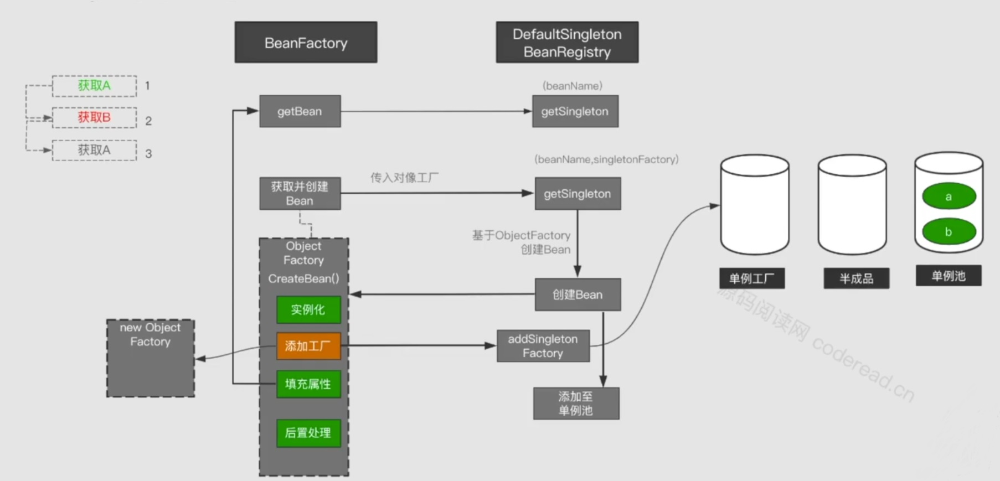
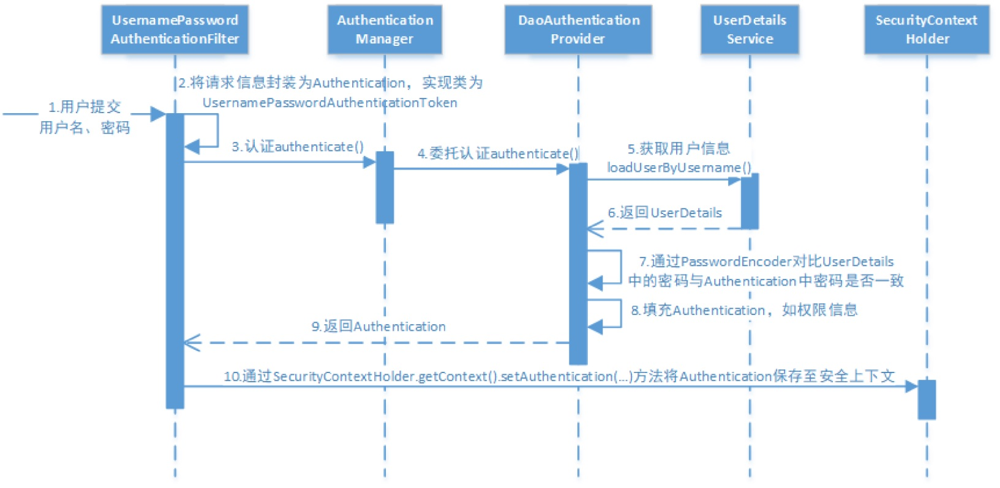

# 代理模式
## 静态代理


```java
public interface Subject   
{   
  public void doSomething();   
}
public class RealSubject implements Subject   
{   
  public void doSomething()   
  {   
    System.out.println( "call doSomething()" );   
  }   
}
public class SubjectProxy implements Subject
{
  Subject subimpl = new RealSubject();
  public void doSomething()
  {
     subimpl.doSomething();
  }
}
public class TestProxy 
{
   public static void main(String args[])
   {
       Subject sub = new SubjectProxy();
       sub.doSomething();
   }
}
```
**优点:**
可以在不修改目标类的情况下, 扩展目标类的功能
**缺点:**
1. 冗余, 如果有多个类, 每个类都必须手动编写代理类
2. 不易维护. 如果接口增加方法, 那么目标类和代理类都必须修改

## 动态代理
> **反射:** 是可以在运行时期动态获取任何类的信息,如属性和方法. 
**目的:** 不写代理类，而直接得到代理Class对象，然后根据它创建代理实例

JDK提供了java.lang.reflect.InvocationHandler接口和 java.lang.reflect.Proxy类，这两个类相互配合，入口是Proxy
Proxy有个静态方法：getProxyClass(ClassLoader, interfaces)，只要你给它传入类加载器和一组接口，它就给你返回代理Class对象(接口本身没有构造器)


<center>静态代理</center>


<center>动态代理</center>

Proxy.getProxyClass()这个方法的本质就是：==以Class造Class==

```java
public class ProxyTest {
	public static void main(String[] args) throws Throwable {
		CalculatorImpl target = new CalculatorImpl();
		Calculator calculatorProxy = (Calculator) getProxy(target);
		calculatorProxy.add(1, 2);
		calculatorProxy.subtract(2, 1);
	}

	private static Object getProxy(final Object target) throws Exception {
		Object proxy = Proxy.newProxyInstance(
				target.getClass().getClassLoader(),/*类加载器*/
				target.getClass().getInterfaces(),/*让代理对象和目标对象实现相同接口*/
				new InvocationHandler(){/*代理对象的方法最终都会被JVM导向它的invoke方法*/
					public Object invoke(Object proxy, Method method, Object[] args) throws Throwable {
						System.out.println(method.getName() + "方法开始执行...");
						Object result = method.invoke(target, args);
						System.out.println(result);
						System.out.println(method.getName() + "方法执行结束...");
						return result;
					}
				}
		);
		return proxy;
	}
}
```


### JDK 动态代理和 CGLIB 动态代理的区别
- JDK是基于反射机制,==生成一个实现代理接口的匿名类==,然后重写方法,实现方法的增强.
它生成类的速度很快,但是运行时因为是基于反射,调用后续的类操作会很慢.
而且他是只能针对接口编程的.
- CGLIB是基于继承机制,继承被代理类,所以方法不要声明为final,然后重写父类方法达到增强了类的作用.
它底层是基于asm第三方框架,是对代理对象类的class文件加载进来,通过修改其字节码生成子类来处理.
生成类的速度慢,但是后续执行类的操作时候很快.
可以针对类和接口(不能针对 final 类).==如果目标类的方法是final的话，就会直接调用目标类的方法==

#### 反射为什么慢
1. 接口的通用性，java 的invoke 方法 是传object, 和object[] 数组的。
也就是如果是简单类型的话，在接口处必须封装成object
2. 在调用的时候，产生了额外的不必要的内存浪费，当调用次数达到一定量的时候，最终还导致了GC。
3. method.invoke中要进行方法可见性检查
# spring 启动过程


## ioc 容器的启动过程
refresh 方法, 叫 refresh 是因为在修改配置文件后, 可以动态调用该方法刷新容器, ==主要用于对 beanDefinition 的载入, 以及对容器自身一些生命周期和管理工作==

beanDefinition 的载入
1. resource 定位, 包括 xml, 注解
2. beanDefinition 的装载和解析
    1. 根据 xml 资源获取相应的 document 对象
    2. 将 document 对象根据标签 `<import>, <bean>` 转换成 beanDefinition 对象
3. beanDefinition 注册, 将得到的 beanDefinition 注入一个 hashMap

此时 IOC 容器得到了创建 bean 所需要的配置信息. ==注意此时还没有真正的创建 bean==


## bean 的生命周期


### bean 的诞生
1. 显式调用 getBean() 方法
2. IOC 容器隐式调用 getBean() 方法, 当 bean 配置非懒加载时. 单例模式默认非懒加载. 那么当 ioc 容器初始化后, 会隐式调用 getBean() 方法

### bean 的产生
1. 向容器设置指定 bean 正在创建的 flag
2. 从容器获得 beanDefinition
3. ==检查 bean 的依赖(?????)==
4. 根据作用域执行不同的创建方法
    1. 单例模式
        1. getSingleton(beanName, singletonFactory), 如果不存在会调用 createBean()
        2. 放入一级缓存
    2. 原型模式
        1. createBean

#### createBean
1. 实例化 bean, 通过反射调用构造方法, 此时未注入属性
2. 添加一个单例工厂到三级缓存(singletonFactory) 
3. 进行属性注入, 此时如果属性是一个 bean 会递归调用 getBean() 方法
4. 初始化 bean
    1. 如果实现某个 aware 接口, 会调用对应方法
    2. 前置处理器, 在 bean 初始化前后添加自己的逻辑
    3. 调用 init 方法
    4. 后置处理器. ==aop 替换对象在这个步骤==
5. 注册 bean 到 ioc 单例池容器

[生命周期](https://www.jianshu.com/p/1dec08d290c1)

## 解决循环依赖问题
A拥有B的属性，B拥有A的属性

spring在单例情况下默认支持循环引用。



1. 获取A
    1. getBean(), 进入getSingleton(beanName), 在三个缓存池里都找不到A, 进入2
    2. 获取并创建 bean, getSingleton(beanName, singletonFactory), 先创建 bean, 然后添加工厂到三级缓存
    3. 填充属性, 发现B
2. 获取B
    同上
3. 获取A
    1. getBean(), 进入getSingleton(beanName), 在三级缓存找到工厂A, 调用getObject() 方法, 将得到的半成品放进半成品池子, 并将工厂A 从三级缓存中移去
    2. 返回2

**为什么不是一级缓存**
因为 ioc 容器的注册是在 bean 创建的最后一步, 也就是说实例化, 注入属性, 初始化之后再放进 ioc 容器, 保证 ioc 容器里的对象都是完整的. 如果是一级缓存, 也就是把当前不完整的 A 放进 ioc 容器, 理论上可以, 但违背了 ioc 容器里的对象都是完整的原则, 并且有可能因为后续的代理对象导致 A 对象空指针

**为什么不是二级缓存?**
因为如果把单例工厂去掉, 即把实例化后的对象放入半成品池子.
==因为单例工厂不仅是会实例化对象, 而且会进行后置处理, 可能还会返回的是代理对象==
比如: ==把半成品 A 放入二级缓存, 然后 B 注入属性时得到 半成品 A, 但 A 在后置处理器中返回了代理对象, 此时就会得到 ioc 容器里的 A 是代理对象, 而 B 对象里的 A 是非代理对象==

而三级缓存的做法是, ==当我们遇到循环依赖时, B 从三级缓存拿到 A 的单例工厂bean, 调用其 getObject() 方法, 会调用各个后置处理器的 getEarlyReference() 方法, 此时返回的就是代理对象了==

[参考](https://www.yisu.com/zixun/317220.html)

**为什么要包装一层ObjectFactory对象**
如果创建的Bean有对应的代理，那其他对象注入时，注入的应该是对应的代理对象；但是Spring无法提前知道这个对象是不是有循环依赖的情况，而正常情况下（没有循环依赖情况），==Spring都是在创建好完成品Bean之后才创建对应的代理==。这时候Spring有两个选择：
1. 不管有没有循环依赖，都提前创建好代理对象，并将代理对象放入缓存，出现循环依赖时，其他对象直接就可以取到代理对象并注入。
2. 不提前创建好代理对象，在出现循环依赖被其他对象注入时，才实时生成代理对象。这样在没有循环依赖的情况下，Bean就可以按着Spring设计原则的步骤来创建。

Sping选择了第二种，如果是第一种，就会有以下不同的处理逻辑：
1. 在提前曝光半成品时，直接执行getEarlyBeanReference创建到代理，并放入到缓存earlySingletonObjects中。
2. 那就不需要通过ObjectFactory来延迟执行getEarlyBeanReference，也就不需要singletonFactories这一级缓存。

如果要使用二级缓存解决循环依赖，意味着Bean在构造完后就创建代理对象，这样违背了Spring设计原则。Spring结合AOP跟Bean的生命周期，是在Bean创建完全之后通过AnnotationAwareAspectJAutoProxyCreator这个后置处理器来完成的，在这个后置处理的postProcessAfterInitialization方法中对初始化后的Bean完成AOP代理。如果出现了循环依赖，那没有办法，只有给Bean先创建代理，但是没有出现循环依赖的情况下，设计之初就是让Bean在生命周期的最后一步完成代理而不是在实例化后就立马完成代理。

## 依赖注入
通过引入IOC容器，利用依赖关系注入的方式，实现对象之间的解耦，对象之间互相感受不到对方的存在（因为你不需要显式地声明new）

## beanDifinition
用于描述一个 bean 实例, 包装一个对象, ==使其能被 beanFactory 接收并处理==


**举例:** 
1. 该 bean 是否是单例的
2. 是否懒加载
3. 需要调用哪个初始化方法/销毁方法

## 后置处理器


## beanFactoryPostProcessor 作用
可以对 bean 进行定制化的操作, 比如对 bean 的属性进行修改或添加.
发生在 bean 被读取进来, 但还没有初始化的时候, 此时传入的参数是一个 beanFactory, 我们可以从中获取到特定的 beanDefinition
```java
public class MyBeanFactoryPostProcessor implements BeanFactoryPostProcessor {
 
    public void postProcessBeanFactory(ConfigurableListableBeanFactory beanFactory) throws BeansException {
        System.out.println("调用MyBeanFactoryPostProcessor的postProcessBeanFactory");
        BeanDefinition bd = beanFactory.getBeanDefinition("myJavaBean");
        System.out.println("属性值============" + bd.getPropertyValues().toString());
        MutablePropertyValues pv =  bd.getPropertyValues();  
        if (pv.contains("remark")) {  
            pv.addPropertyValue("remark", "把备注信息修改一下");  
        }  
        bd.setScope(BeanDefinition.SCOPE_PROTOTYPE);
    }
}
```

## BeanPostProcessor 作用
支持在 bean 的初始化前后, 对 bean 进行定制化
**举例:**
我们希望在普通Bean中注入 ApplicationContext (不使用 autowired)
1. 可以让Bean实现ApplicationContextAware接口

2. 在初始化 bean 时, 遍历所有的 beanPostProcessor, 此时有一个 ApplicationContextProcessor, 他会检查类是否继承了 ApplicationContextAware, 如果是, 则调用 setApplicationContext 方法


## bean 的作用域
使用 `scope` 注解里的`scopeName`配置

| 类型 | 说明 |
| - | - |
|singleton | Spring容器中只会存在一个共享的Bean实例 |
|prototype | 每次对该Bean请求的时候，Spring IoC都会创建一个新的作用域。 |
|request|Request作用域针对的是每次的Http请求，Spring容器会根据相关的Bean的定义来创建一个全新的Bean实例。而且该Bean只在当前request内是有效的。
|session|针对http session起作用，Spring容器会根据该Bean的定义来创建一个全新的Bean的实例。而且该Bean只在当前http session内是有效的。|
|global session|类似标准的http session作用域，不过仅仅在基于portlet的web应用当中才有意义。|

## beanFactory 和 factoryBean
### beanFactory
beanFactory 本质上是一个容器, sping IOC 容器的核心接口. 职责是==实例化、定位、配置应用程序中的对象及建立这些对象间的依赖==. applicationContext 就是继承了 beanFactory
**使用场景:**
1. 从 IOC 容器中获取 bean `getBean()`
2. 检查是否包含指定的 bean `containsBean()`
3. 判断是否单例 `isSingleton()` 

### factoryBean
1. 首先是一个 bean, 因此也是在 beanFactory 容器中, 同时又是一个工厂, 并且支持泛型, 能够在需要时返回任何一个对象, ==创建的对象是否单例由 isSingleton() 方法决定==
2. 如果一个 bean A 实现了 factoryBean 接口, 那么这个 bean A 就变成了一个工厂, 它有一个 target 的属性, 代表着他实际生产的对象
3. 当使用容器的 getBean() 方法, 实际上是调用了 factoryBean 的getObject() 方法, 因此返回并不是 bean A 本身, 如果想返回 beanA, 那么须在getBean 的参数名字前面 `'&'`

**使用场景:**
一般情况下，Spring通过反射机制利用`<bean>`的class属性指定实现类实例化Bean，在某些情况下，实例化Bean过程比较复杂，如果按照传统的方式，则需要在`<bean>`中提供大量的配置信息。配置方式的灵活性是受限的，这时采用编码的方式可能会得到一个简单的方案

## 事务传播行为
事务传播行为（propagation behavior）指的就是当一个事务方法被另一个事务方法调用时，这个事务方法应该如何进行。
==要注意 @Transaction 注解使用了 AOP, 即调用方法时会有拦截器代理对象调用方法. 因此在非事务方法里, 调用本类事务方法不会生成事务, 因为使用的是 this 对象==
以下针对 A 类 a 方法与 B 类 b 方法
**spring 定义了七种事务传播行为**

默认是第一种

1. PROPAGATION_REQUIRED
如果存在一个事务, 则加入, 如果不存在, 则新建


2. PROPAGATION_SUPPORTS
如果存在事务, 则加入事务. 如果不存在, 则以非事务方法运行
    ```java
    @Transactional(propagation = Propagation.REQUIRED)
    public void methodA() {
        methodB();
        // do something
    }
    
    // 事务属性为SUPPORTS
    @Transactional(propagation = Propagation.SUPPORTS)
    public void methodB() {
        // do something
    }
    ```
    单纯的调用methodB时，methodB方法是非事务的执行的。当调用methdA时,methodB则加入了methodA的事务中,事务地执行

3. PROPAGATION_MANDATORY
如果已经存在一个事务，支持当前事务。如果没有一个活动的事务，则抛出异常

4. PROPAGATION_REQUIRES_NEW
使用PROPAGATION_REQUIRES_NEW,需要使用 JtaTransactionManager作为事务管理器。
它会开启一个新的事务。如果一个事务已经存在，则先将这个存在的事务挂起。
    ```java
    main() {
        TransactionManager tm = null;
        try {
            // 获得一个 JTA 事务管理器
            tm = getTransactionManager();
            tm.begin();// 开启一个新的事务
            Transaction ts1 = tm.getTransaction();
            doSomeThing();
            tm.suspend();// 挂起当前事务
            try {
                tm.begin();// 重新开启第二个事务
                Transaction ts2 = tm.getTransaction();
                methodB();
                ts2.commit();// 提交第二个事务
            } catch(RunTimeException ex) {
                ts2.rollback();// 回滚第二个事务
            } finally {
                // 释放资源
            }
            // methodB执行完后，恢复第一个事务
            tm.resume(ts1);
            doSomeThingB();
            ts1.commit();// 提交第一个事务
        } catch(RunTimeException ex) {
            ts1.rollback();// 回滚第一个事务
        } finally {
            // 释放资源
        }
    }
    ```
    在这里，我把ts1称为外层事务，ts2称为内层事务。从上面的代码可以看出，ts2与ts1是两个独立的事务，互不相干。Ts2是否成功并不依赖于 ts1。如果methodA方法在调用methodB方法后的doSomeThingB方法失败了，而methodB方法所做的结果依然被提交。而除了 methodB之外的其它代码导致的结果却被回滚了
5. PROPAGATION_NOT_SUPPORTED
总是非事务地执行，并挂起任何存在的事务。也需要使用JtaTransactionManager作为事务管理器

6. PROPAGATION_NEVER
总是非事务地执行，如果存在一个活动事务，则抛出异常

7. PROPAGATION_NESTED
如果一个活动的事务存在，则运行在一个嵌套的事务中。 如果没有活动事务, 则按PROPAGATION_REQUIRED 属性执行。
这是一个嵌套事务,使用 JDBC 3.0 驱动时,仅仅支持DataSourceTransactionManager作为事务管理器。需要JDBC 驱动的java.sql.Savepoint类。使用PROPAGATION_NESTED，还需要把PlatformTransactionManager的nestedTransactionAllowed属性设为true(属性值默认为false)。
这里关键是嵌套执行。
    ```java
    main() {
        Connection con = null;
        Savepoint savepoint = null;
        try {
            con = getConnection();
            con.setAutoCommit(false);
            doSomeThingA();
            savepoint = con2.setSavepoint();
            try {
                methodB();
            } catch(RuntimeException ex) {
                con.rollback(savepoint);
            } finally {
                // 释放资源
            }
            doSomeThingB();
            con.commit();
        } catch(RuntimeException ex) {
            con.rollback();
        } finally {
            // 释放资源
        }
    }
    ```
    当methodB方法调用之前，调用setSavepoint方法，==保存当前的状态到savepoint==。如果methodB方法调用==失败，则恢复到之前保存的状态==。但是需要注意的是，这时的事务并没有进行提交，如果后续的代码(doSomeThingB()方法)调用失败，则==回滚包括methodB方法的所有操作。==
    > 嵌套事务一个非常重要的概念就是==内层事务依赖于外层事务==。外层事务失败时，会回滚内层事务所做的动作。而内层事务操作失败并不会引起外层事务的回滚。嵌套事务是外部事务的一部分, 只有外部事务结束后它才会被提交.

### spring 事务与多线程
- Spring中DAO和Service都是以单实例的bean形式存在，Spring通过ThreadLocal类将有状态的变量（例如数据库连接Connection）本地线程化，从而做到多线程状况下的安全。在一次请求响应的处理线程中， 该线程贯通展示、服务、数据持久化三层，通过ThreadLocal使得所有关联的对象引用到的都是同一个变量
- 当Spring事务方法运行时，就产生一个事务上下文，它在本事务执行线程中对同一个数据源绑定了一个唯一的数据连接，所有被该事务上下文传播的方法都共享这个连接(即如果在事务方法调用非事务方法, 会自动加入事务)

### 嵌套事务与异常
当默认的事务传播方式为 PROPAGATION_REQUIRED, 且内层事务丢出异常时, 外层事务会在正常执行完成后抛出 `rollback-only` 异常, 并回滚全部sql.
- 如果希望在内层事务抛出异常后, 立即回滚, 可在异常捕获中直接抛出异常
- 如果希望内层事务的报错不要影响外层事务的执行, 可考虑 PROPAGATION_NESTED 的事务传播, 他会设置一个 safepoint, 当内层事务报错会恢复到 safepoint
- 如果考虑两个事务互不干扰, 考虑 PROPAGATION_REQUIRES_NEW

## spingboot 启动流程


## springboot 的自动配置
[自动配置](https://segmentfault.com/a/1190000030685746)


分为 bean 的自动配置和属性的自动配置
### bean 的自动配置
也就是我们没有 new 而是直接导入一个 starter 包就可以使用

1. 在启动类上有 @springbootapplication (标注这是一个 springboot应用)的注解 
2. 这个注解有绑定一个开启自动配置的注解
3. 这个注解 import (导入)了一个扫描类
4. 这个扫描类会去扫描各个 jar 包下的 MEAT-INF/spring.factories 的文件
5. 这些文件都有一个 key 是相同的 EnableAutoConfiguration, 而 value 是一些自动配置类
6. spring 会找到这些自动配置类, 然后注入里面标注了 bean 注解的对象, 每个 xxAutoConfiguration 类都可以选择性的生效, 通过 @Conditional 实现


### 属性的自动配置
通过后置处理器, 在创建 bean 的时候, 扫描其是否有 configurationProperties 注解, 他会解析注解的 value, 然后和配置文件的对应 key 的值绑定起来

# spring security
[参考](https://www.cnkirito.moe/categories/Spring-Security/)
[参考](https://cloud.tencent.com/developer/article/1765703 )
## 核心组件

### securityContextHolder
用于存储安全上下文 (security context) 的信息(当前用户, 是否已经认证, 拥有的权限)
==默认使用 threadlocal 存储信息. 将用户与线程绑定==

#### 获取当前用户信息
==因为身份信息与线程绑定, 因此可以在程序的任何地方使用静态方法获取用户信息==

```java
Object principal = SecurityContextHolder.getContext().getAuthentication().getPrincipal();

if (principal instanceof UserDetails) {
    String username = ((UserDetails)principal).getUsername();
} else {
    String username = principal.toString();
}
```

getAuthentication()返回了认证信息，再次 getPrincipal() 返回了身份信息，UserDetails 便是 Spring 对身份信息封装的一个接口

### Authentication
```java
package org.springframework.security.core;// <1>

public interface Authentication extends Principal, Serializable { // <1>
    Collection<? extends GrantedAuthority> getAuthorities(); // <2>

    Object getCredentials();// <2>

    Object getDetails();// <2>

    Object getPrincipal();// <2>

    boolean isAuthenticated();// <2>

    void setAuthenticated(boolean var1) throws IllegalArgumentException;
}
```

- getAuthorities() : 权限列表, 默认是 GrantedAuthority 接口的一些实现类, 通常是代表权限的一系列字符串
- getCredentials() : 密码信息, 通常在验证后会移除
- getPrincipal() : 通常返回 UserDetails 的实现类

### spring security 大致身份认证过程

1. 用户名和密码被过滤器获取, 封装成 `authentication`, 通常是 `UsernamePasswordAuthenticationToken` 这个实现类
2. AuthenticationManager 身份管理器负责验证这个 Authentication
3. 认证成功后, AuthenticationManager 身份管理器返回一个填充了信息的 Authentication (如权限等, 但密码通常移去)
4. SecurityContextHolder 安全上下文容器通过SecurityContextHolder.getContext().setAuthentication(), 将该 Authentication 与线程绑定

### AuthenticationManager
AuthenticationManager 是认证的接口, 也是发起认证的出发点. 但他==一般不直接进行认证, 而是通过委托者模式==委托给各个 AuthenticationProvider 进行认证

原因在于 spring security 支持多种验证方式, 除了传统的用户名密码, 还支持邮箱密码, 手机号密码, 甚至指纹, 因此每种验证方式对应一个 AuthenticationProvider 实现类. 默认策略下, 只需要通过其中一个便可认证成功

1. AuthenticationManager 接口的常用实现类 providerManager 内部会维护一个 `List<AuthenticationProvider>` 
2. 当执行验证方法时, 会按照 list 里的依次顺序依次验证, 如果返回非 null, 则立刻返回, 如果为 null 则下一个 AuthenticationProvider 尝试验证
3. 如果都返回 null, 则会抛出异常

#### DaoAuthenticationProvider
AuthenticationProvider 中常用的一个实现 DaoAuthenticationProvider. retrieveUser() 方法利用前面得到的用户名去数据库查找对应的记录返回 UserDetails 对象. additionalAuthenticationChecks 进行密码对比, 如果没有抛出异常, 则说明密码正确

### UserDetails 和 UserDetailsService
UserDetails 与前面的 Authentication 接口类似, 都有 username, authorities 属性

但 Authentication 的 getCredentials()与 UserDetails 中的 getPassword() 需要被区分对待，前者是用户提交的密码凭证，后者是用户正确的密码，认证器其实就是对这两者的比对

UserDetailsService 则负责从特定的地方(数据库, 内存) 获取用户信息, 封装成 UserDetails, 用于 AuthenticationProvider 中与 Authentication 进行对比

## 核心配置
### 1. DelegatingFilterProxy
通过 DelegatingFilterProxyRegistrationBean 这个 bean 来帮助注册的, RegistrationBean 是 spring boot 用于将 servlet, filter 容器化的注册类

它本身是 Spring Web 包中的类，并不是 SpringSecurity 中的类. 使用这个代理类来代理真正的 SpringSecurityFilterChain.

DelegatingFilterProxy 实现了 javax.servlet.Filter 接口, 使得他可以作为一个标准的 web 过滤器, 职责==用于从容器中获取并调用真正的 springSecurityFilterChain - FilterChainProxy==

### 2. @EnableWebSecurity
```java
@Import({ WebSecurityConfiguration.class, // <2>
      SpringWebMvcImportSelector.class }) // <1>
@EnableGlobalAuthentication // <3>
@Configuration
public @interface EnableWebSecurity {
   boolean debug() default false;
}
```

一个组合注解, 其中 @Import 是 springboot 提供的用于引入外部的配置的注解
用于加载两个核心配置类
1. WebSecurityConfiguration 
2. AuthenticationConfiguration 

#### 2.1 WebSecurityConfiguration
完成了声明注册 springSecurityFilterChain(实质类 SecurityFilterChain) 的作用，并且最终交给 DelegatingFilterProxy 这个代理类，负责拦截请求（注意 DelegatingFilterProxy 这个类不是 spring security 包中的，而是存在于 web 包中，spring 使用了代理模式来实现安全过滤的解耦）

也就是说 DelegatingFilterProxy 最终调用 springSecurityFilterChain

##### 2.1.1 SecurityFilterChain
在 WebSecurityConfiguration 中声明注册

#### 2.2 AuthenticationConfiguration
负责生成全局的身份认证管理者 AuthenticationManager

### 3. WebSecurityConfigurerAdapter
使用==适配器模式, 使用 adapter 的好处是: 我们可以选择性的修改我们的配置, 而不用覆盖其他不相关的配置==

常用
```java
@Configuration
@EnableWebSecurity
public class CustomWebSecurityConfig extends WebSecurityConfigurerAdapter {
  
    @Override
    protected void configure(HttpSecurity http) throws Exception {
        http
            .authorizeRequests()
                .antMatchers("/resources/**", "/signup", "/about").permitAll()
                .antMatchers("/admin/**").hasRole("ADMIN")
                .antMatchers("/db/**").access("hasRole('ADMIN') and hasRole('DBA')")
                .anyRequest().authenticated()
                .and()
            .formLogin()
                .usernameParameter("username")
                .passwordParameter("password")
                .failureForwardUrl("/login?error")
                .loginPage("/login")
                .permitAll()
                .and()
            .logout()
                .logoutUrl("/logout")
                .logoutSuccessUrl("/index")
                .permitAll()
                .and()
            .httpBasic()
                .disable();
    }
}
```

可以配置某些资源直接放行, 某些资源需要登陆

## 核心过滤器
### 1. SecurityContextPersistenceFilter
1. 请求来临时创建 securityContext 安全上下文信息, 比如根据 sessionId 将已经认证过的信息放入 securityContextHolder
2. 请求结束时清空 securityContextHolder 中的信息

因此处于第一个和最后一个过滤器

### 2. UsernamePasswordAuthenticationFilter
将客户端表单提交的用户名和密码封装成 Authentication 对象, 并交由 authenticationManager 完成认证

### 3. AnonymousAuthenticationFilter
位于身份认证过滤器的最后, 用于给匿名用户一个身份. 比如有些资源是不需要登陆就可以访问的

### 4. ExceptionTranslationFilter
用于转化在前面过滤链中的异常
转化意味着没有自己处理, 而是交由 handler 去处理, 比如认证失败委托给 AuthenticationEntryPoint 去处理

### 5. FilterSecurityInterceptor
FilterSecurityInterceptor 从 SecurityContextHolder 中
1. 获取 Authentication 对象
2. 比对用户拥有的权限和资源所需的权限

资源所需的资源可以通过注解声明, FilterSecurityInterceptor 通过委托给 SecurityMetadataSource 通过反射获取

之后委托给 AccessDecisionManager 通过投票来确定是否可以访问, 默认是一票通过, 比如注解 `PreAuthorize("hasAuthority('super')) `

